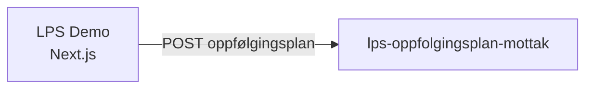

# Oppfølgingsplan Lps demofrontendapp

     

## Miljø

🎬 [Demo](https://demo.ekstern.dev.nav.no/oppfolgingsplan-lps)

## Formålet med appen

Appen er en interaktiv demo for **team-esyfo** som viser LPS-integrasjonen for oppfølgingsplaner. Den er ikke en produksjonsapp, men brukes til å demonstrere og teste innsendingsflyten mot [lps-oppfolgingsplan-mottak](https://github.com/navikt/lps-oppfolgingsplan-mottak).

## Backend-API

Appen kommuniserer med:

**[lps-oppfolgingsplan-mottak](https://github.com/navikt/lps-oppfolgingsplan-mottak)** — mottar innsendte oppfølgingsplaner fra LPS-systemer

## Utvikling (kjøre lokalt)

For å komme i gang med å bygge og kjøre appen, se vår [Wiki for frontendapper](https://navikt.github.io/team-esyfo/utvikling/frontend/).

Når appen er startet, åpne http://localhost:3000/oppfolgingsplan-lps

## For Nav-ansatte

Interne henvendelser kan sendes via Slack i kanalen [#esyfo](https://nav-it.slack.com/archives/C012X796B4L).
