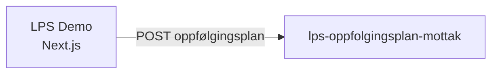

# oppfolgingsplan-lps-demo

[](https://github.com/navikt/oppfolgingsplan-lps-demo/actions/workflows/build-and-deploy.yaml)

Demo-applikasjon som viser hvordan en oppfølgingsplan sendes inn fra et lege-/praksiskonsultasjonssystem (LPS) til NAV. Appen simulerer flyten der behandlere fyller ut en oppfølgingsplan med arbeidssituasjon, tilrettelegging og oppfølgingsinfo, og sender den videre.

## Formål

Appen er en interaktiv demo for **team-esyfo** som viser LPS-integrasjonen for oppfølgingsplaner. Den er ikke en produksjonsapp, men brukes til å demonstrere og teste innsendingsflyten mot [lps-oppfolgingsplan-mottak](https://github.com/navikt/lps-oppfolgingsplan-mottak).

## Teknologier

| Kategori | Teknologi |
|---|---|
| Rammeverk | [Next.js](https://nextjs.org/) 16 (App Router, standalone output) |
| Språk | [TypeScript](https://www.typescriptlang.org/) 6 |
| UI-bibliotek | [NAV Aksel Design System](https://aksel.nav.no/) (`@navikt/ds-react` v8) |
| Skjema | [React Hook Form](https://react-hook-form.com/) |
| Styling | [Tailwind CSS](https://tailwindcss.com/) 4 + Aksel tokens |
| Linter/Formatter | [Biome](https://biomejs.dev/) |
| Git hooks | [Lefthook](https://github.com/evilmartians/lefthook) |
| Logging | [@navikt/next-logger](https://github.com/navikt/next-logger) (Pino) |
| HTTP-klient | [Axios](https://axios-http.com/) |
| Plattform | [NAIS](https://doc.nais.io/) (Kubernetes på GCP) |

## Kom i gang

### Forutsetninger

- [Node.js](https://nodejs.org/) 24
- [pnpm](https://pnpm.io/) 10

### Utvikling

```bash
pnpm install
pnpm run dev
```

Åpne [http://localhost:3000/oppfolgingsplan-lps](http://localhost:3000/oppfolgingsplan-lps) i nettleseren.

### Kommandoer

| Kommando | Beskrivelse |
|---|---|
| `pnpm run dev` | Start utviklingsserver |
| `pnpm run build` | Bygg for produksjon |
| `pnpm run lint` | Kjør Biome linter |
| `pnpm run format` | Sjekk formatering |
| `pnpm run check` | Kjør lint + format |

## Backend-referanser

Appen kommuniserer med:

- **[lps-oppfolgingsplan-mottak](https://github.com/navikt/lps-oppfolgingsplan-mottak)** — mottar innsendte oppfølgingsplaner fra LPS-systemer

## Arkitektur



## Miljø

| Miljø | URL |
|---|---|
| Demo (dev-gcp) | https://demo.ekstern.dev.nav.no/oppfolgingsplan-lps |

## Kontakt

- **Team**: [team-esyfo](https://github.com/orgs/navikt/teams/team-esyfo)
- **Slack**: #team-esyfo
