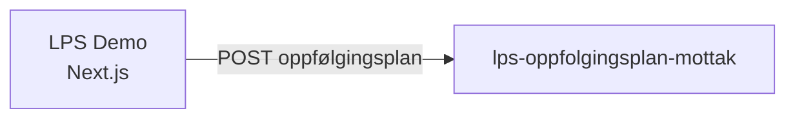

# Oppfølgingsplan Lps demo frontendapp

[](https://github.com/navikt/oppfolgingsplan-lps-demo/actions/workflows/build-and-deploy.yaml) [](https://biomejs.dev/) [](https://www.typescriptlang.org/) [](https://nextjs.org/) [](https://doc.nais.io/) [](https://aksel.nav.no/)

Demo-applikasjon som viser hvordan en oppfølgingsplan sendes inn fra et lege-/praksiskonsultasjonssystem (LPS) til NAV. Appen simulerer flyten der behandlere fyller ut en oppfølgingsplan med arbeidssituasjon, tilrettelegging og oppfølgingsinfo, og sender den videre.

## Formålet med appen

Appen er en interaktiv demo for **team-esyfo** som viser LPS-integrasjonen for oppfølgingsplaner. Den er ikke en produksjonsapp, men brukes til å demonstrere og teste innsendingsflyten mot [lps-oppfolgingsplan-mottak](https://github.com/navikt/lps-oppfolgingsplan-mottak).

## Teknologier

**App**
[](https://nextjs.org/) [](https://react.dev/) [](https://www.typescriptlang.org/)

**UI og styling**
[](https://aksel.nav.no/) [](https://tailwindcss.com/) [](https://react-hook-form.com/)

**Verktøy**
[](https://biomejs.dev/) [](https://github.com/evilmartians/lefthook)

**Integrasjon og plattform**
[](https://axios-http.com/) [](https://github.com/navikt/next-logger) [](https://doc.nais.io/)

## Kom i gang

### Forutsetninger

- [Node.js](https://nodejs.org/) 24
- [pnpm](https://pnpm.io/) 10

### Utvikling

```bash
pnpm install
pnpm run dev
```

Åpne [http://localhost:3000/oppfolgingsplan-lps](http://localhost:3000/oppfolgingsplan-lps) i nettleseren.

### Kommandoer

| Kommando          | Beskrivelse            |
| ----------------- | ---------------------- |
| `pnpm run dev`    | Start utviklingsserver |
| `pnpm run build`  | Bygg for produksjon    |
| `pnpm run lint`   | Kjør Biome linter      |
| `pnpm run format` | Sjekk formatering      |
| `pnpm run check`  | Kjør lint + format     |

## Backend-referanser

Appen kommuniserer med:

- **[lps-oppfolgingsplan-mottak](https://github.com/navikt/lps-oppfolgingsplan-mottak)** — mottar innsendte oppfølgingsplaner fra LPS-systemer

## Arkitektur



## Miljø

| Miljø          | URL                                                 |
| -------------- | --------------------------------------------------- |
| Demo (dev-gcp) | https://demo.ekstern.dev.nav.no/oppfolgingsplan-lps |

## Kontakt

- **Team**: [team-esyfo](https://github.com/orgs/navikt/teams/team-esyfo)
- **Slack**: #team-esyfo
